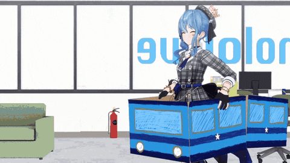

<h1 align="center">Hi there, I'm Rayina Ilham 👋</h1>

  <b>Product Developer</b> | <b>Microservice Architect</b> | <b>AI Engineer</b> | <b>Hoshiyomi</b> | <b>Isaki Rengō</b> | <b>Clipper</b>

  

  

---

   
  
  

  
  
  

### 🚀 About Me

I'm a **Product Manager** and **Product Developer** specialized in **Microservice Ecosystem** and **AI Engineering** with full-stack understanding. I lead **IT Teams** across Frontend, Backend, Database, and ML domains, bringing deep **conceptual understanding** of system implementation across all fields.

A loyal fan of **Hoshimachi Suisei** ☄️ and **Isaki Riona** 👑🎤 from Hololive.

I speak **Bahasa Indonesia** (Native), **Business English**, and **Basic Japanese** (日本語). Based in Indonesia, I vibe code cleanly with deep understanding and love discussing product development, microservices, AI, or why Sui-chan is the best! 

Fun fact: I code better when listening to Hololive streams.

---

### 🧰 Technology Stack

  
  
  
  
  
  
  
  
  
  
  
  
  
  
  
  
  
  

#### 🗣️ Languages

  
  
  

#### 🎬 Content Creation

  
  
  

---

### 📊 GitHub Stats

  
  

  

  

---

### 🏆 GitHub Trophies

  

---

### 📘 Featured Projects

  

| Project | Description | Tech Stack |
|---------|-------------|------------|
| **[Anevia Backend](https://github.com/Anevia-Capstone/anevia-backend)** | AI-powered eye conjunctiva scanning system for anemia detection with Firebase auth and chat assistant | Node.js, Hapi.js, PostgreSQL, Firebase, Google Gemini |
| **[Anevia Backend Model](https://github.com/Anevia-Capstone/anevia-backend-model)** | Deep learning API for anemia detection from conjunctiva images with dual AI models for segmentation and classification | Python, FastAPI, TensorFlow, YOLOv8, OpenCV |
| **[Micro Chatbot](https://github.com/rayinailham/micro-chatbot)** | Production-ready microservice for AI-powered chatbot applications with conversation management | Bun, ElysiaJS, TypeScript, PostgreSQL, OpenRouter API |
| **[Micro Auth](https://github.com/rayinailham/micro-auth)** | Microservice authentication boilerplate with Firebase integration and comprehensive security features | Bun, Hono, TypeScript, Firebase Auth, Zod |
| **[AureaVoice Backend](https://github.com/rayinailham/av-backend)** | Voice accent analysis API for English learners to identify and improve US accent pronunciation | Python, FastAPI, SpeechBrain, PyTorch, Torchaudio |

---

### ☄️ Support My Oshi!

  
  
  

  
  

  
  

  <b>☄️ Sui-chan wa... Kyou mo kawaii!! ☄️</b>
   
  <b>🎤👑 Riona in the house! brr brrrra! 👑🎤</b>

  <i>Go subscribe to them! They're amazing talents who deserve all the love!</i>

---

  

  💙 <b>Thanks for visiting my profile!</b> 💙

  <i>⭐ If you like my work, consider giving a star to my repositories!</i>

  <i>🍴 Feel free to fork and contribute to any of my projects!</i>

---

  ☄️ <i>Powered by Sui-chan's kawaiiness and Riona's energy</i> 👑🎤

