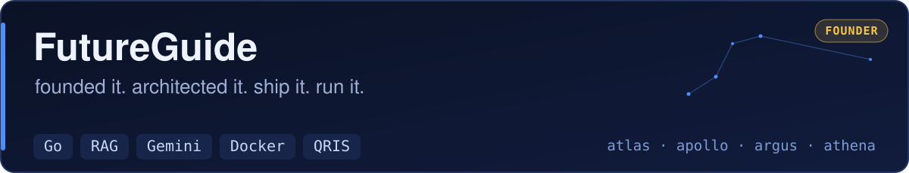
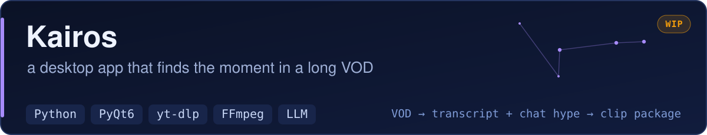
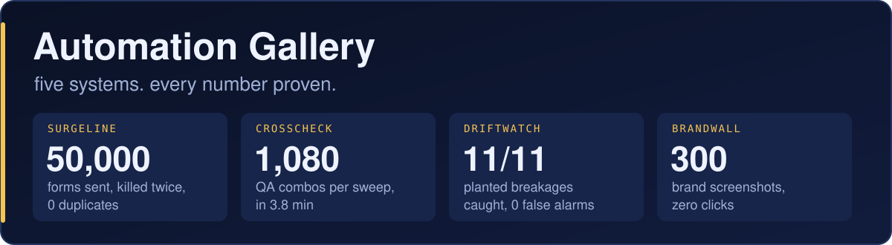
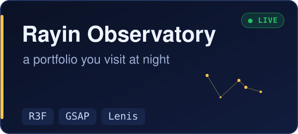
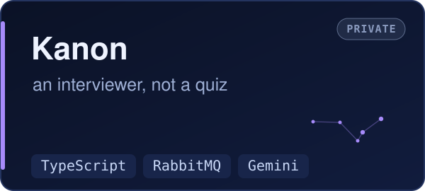
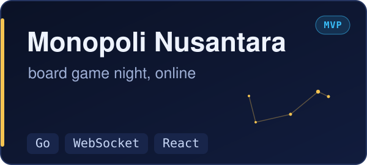
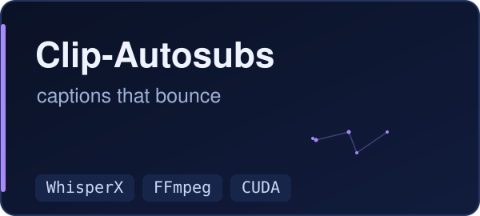
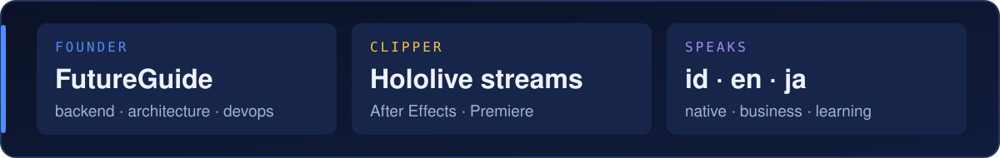

<picture>
  <source media="(prefers-color-scheme: light)" srcset="./assets/hero-light.svg">
  
</picture>

  

  
  
  
  

🇮🇩 Indonesia &nbsp;·&nbsp; founder of FutureGuide &nbsp;·&nbsp; Hololive on the second monitor

  <picture>
    <source media="(prefers-color-scheme: light)" srcset="https://skillicons.dev/icons?i=go%2Cts%2Cpy%2Cc%2Cbun%2Cnodejs%2Cexpress%2Celysia%2Cfastapi%2Cpostgres%2Cmysql%2Credis%2Csupabase%2Cfirebase%2Crabbitmq%2Ckafka%2Csqlite%2Cpytorch%2Ctensorflow%2Copencv%2Cvue%2Cnuxtjs%2Creact%2Cnextjs%2Cthreejs%2Ctailwind%2Cvite%2Cdocker%2Cnginx%2Caws%2Cvercel%2Clinux%2Carch%2Cgit%2Cbash%2Cae%2Cpr&amp;theme=light&amp;perline=10">
    
  </picture>

## 🚀 built

  <a href="https://github.com/WIS-futureguide"><picture><source media="(prefers-color-scheme: light)" srcset="./assets/cards/futureguide-light.svg"></picture></a>

  <picture><source media="(prefers-color-scheme: light)" srcset="./assets/cards/kairos-light.svg"></picture>

  <a href="https://rayin-observatory.vercel.app"><picture><source media="(prefers-color-scheme: light)" srcset="./assets/cards/gallery-light.svg"></picture></a>

  <a href="https://rayin-observatory.vercel.app"><picture><source media="(prefers-color-scheme: light)" srcset="./assets/cards/observatory-light.svg"></picture></a>
  <picture><source media="(prefers-color-scheme: light)" srcset="./assets/cards/kanon-light.svg"></picture>

  <picture><source media="(prefers-color-scheme: light)" srcset="./assets/cards/monopoli-light.svg"></picture>
  <a href="https://github.com/rayinailham/Clip-Autosubs"><picture><source media="(prefers-color-scheme: light)" srcset="./assets/cards/clip-autosubs-light.svg"></picture></a>

  more: <a href="https://github.com/rayinailham/tetra-engine">tetra-engine</a> ·
  <a href="https://rumi-talk.vercel.app">rumi-talk</a> ·
  <a href="https://github.com/rayinailham/surgeline">surgeline</a> ·
  <a href="https://github.com/rayinailham/driftwatch">driftwatch</a> ·
  <a href="https://github.com/rayinailham/micro-chatbot">micro-chatbot</a> ·
  <a href="https://github.com/rayinailham/micro-auth">micro-auth</a>
   next up: a Live2D wallpaper for Hyprland

## 🎬 beyond code

  <picture><source media="(prefers-color-scheme: light)" srcset="./assets/cards/beyond-light.svg"></picture>

## 💫 after hours

  
  &nbsp;
  

  
  

## 📖 guestbook

  
  

<picture>
  <source media="(prefers-color-scheme: light)" srcset="./assets/footer-light.svg">
  
</picture>

  

